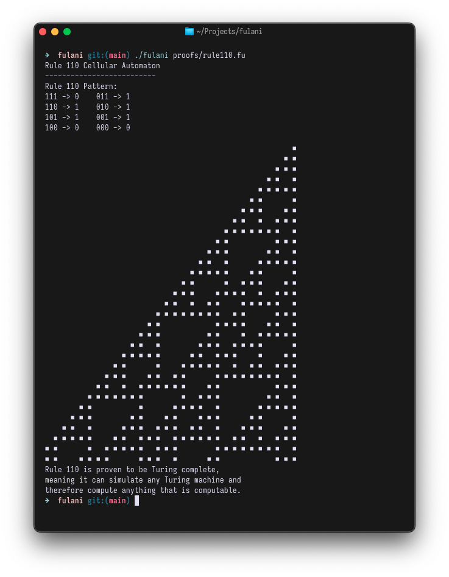

# Fulani Programming Language

Fulani is a simple C-like programming language with a straightforward syntax, designed for educational purposes. It includes essential programming constructs like variables, functions, conditions, and loops. **Fulani is Turing complete**, meaning it can simulate any Turing machine and therefore compute anything that is computable.



## Building and Running

To build the Fulani interpreter:

```bash
make clean && make
```

To run a program:

```bash
./fulani path/to/your/program.fu
```

To run in debug mode (shows execution details):

```bash
./fulani --debug path/to/your/program.fu
```

## Turing Completeness

Fulani's Turing completeness has been demonstrated through implementations of:

- **Rule 110 Cellular Automaton**: A one-dimensional cellular automaton that has been proven to be Turing complete
- **Counter Machine Simulation**: An implementation of a 2-counter machine, which is equivalent to a Turing machine

These examples can be found in the `proofs/` directory.

## Library System

Fulani supports a library inclusion system, allowing you to organize and reuse code. To include a library in your program:

```
include "library_name.fu";
```

Libraries can be placed in:
- The `lib/stdlib/` directory for standard libraries
- The current directory for project-specific libraries
- An absolute or relative path can also be specified

## Standard Library

Fulani comes with a standard library of useful functions and utilities:

### IO Library (io.fu)
- `print()`, `println()`: Output functions
- `error()`, `warning()`: Error reporting functions
- `debug()`: Conditional debug output

### Math Library (math.fu)
- Mathematical constants (PI, E)
- Basic functions: `abs()`, `max()`, `min()`, `pow()`
- Advanced functions: `sqrt()`, `factorial()`, `is_prime()`

### String Library (string.fu)
- String manipulation: `length()`, `substring()`
- String testing: `contains()`, `starts_with()`, `ends_with()`
- Conversion utilities: `int_to_string()`, `float_to_string()`, `bool_to_string()`

### Data Structures Library (data.fu)
- Stack operations: `stack_push()`, `stack_pop()`, `stack_peek()`
- Queue operations: `queue_enqueue()`, `queue_dequeue()`, `queue_peek()`
- Search algorithms: `binary_search()`
- Sorting algorithms: `selection_sort()`

### List Library (list.fu)
- List operations: `contains()`, `index_of()`, `copy()`
- Utility functions: `sum()`, `max_value()`, `min_value()`
- String utilities: `join()`

## Language Features

### Data Types

- `int`: Integer values
- `float`: Floating-point values
- `string`: Text strings
- `bool`: Boolean values (true or false)
- `list`: Dynamic lists that can store values
- `void`: Used for functions that don't return a value

### Comments

- Single-line comments: `// This is a comment`
- Multi-line comments: `/* This is a multi-line comment */`
- Nested comments are supported: `/* Outer comment /* Inner comment */ still outer */`

### Variables

Variables must be declared with a type and can be initialized in the declaration:

```
int x = 10;
float y = 3.14;
string message = "Hello, World!";
```

Multiple variables of the same type can be declared together:

```
int a, b, c;
```

### Operators

- Arithmetic: `+`, `-`, `*`, `/`, `%`
- Comparison: `==`, `!=`, `<`, `>`, `<=`, `>=`
- Assignment: `=`

### Control Flow

**Conditional statements**:

```
if (condition) {
    // code
} else {
    // code
}
```

**Loops**:

```
while (condition) {
    // code
}

for (initialization; condition; increment) {
    // code
}
```

### Data Structures

**Lists**:
```
list myList;
myList.add(value);        // Add an element
myList.remove(index);     // Remove element at index
int size = myList.length; // Get list length
int value = myList[0];    // Access element by index
```

### Functions

Functions are defined with a return type, name, parameters, and body:

```
int add(int a, int b) {
    return a + b;
}
```

The `main` function is the entry point for execution:

```
void main() {
    // Your program starts here
}
```

### Built-in Functions

- `print(value1, value2, ...)`: Prints values without a newline
- `println(value1, value2, ...)`: Prints values followed by a newline

## Examples

### Fibonacci Sequence

```
int fib(int n) {
    if (n == 0) return 0;
    if (n == 1) return 1;
    
    int a = 0;
    int b = 1;
    int i = 2;
    int result = 0;

    while (i <= n) {
        result = a + b;
        a = b;
        b = result;
        i = i + 1;
    }

    return b;
}

void main() {
    int i = 0;
    while (i <= 10) {
        println(i, ": ", fib(i));
        i = i + 1;
    }
}
```

### Prime Number Check

```
int is_prime(int n) {
    if (n < 2) return 0;
    if (n == 2) return 1;
    
    int i = 2;
    while (i * i <= n) { 
        if (n % i == 0) {
            return 0;
        }
        i = i + 1;
    }
    
    return 1;
}

void main() {
    int i = 1;
    while (i <= 20) {
        if (is_prime(i)) {
            println(i, " is prime");
        } else {
            println(i, " is not prime");
        }
        i = i + 1;
    }
}
```

## Language Implementation

The language implementation consists of several components:

- **Lexer**: Converts source code into tokens
- **Parser**: Builds an Abstract Syntax Tree (AST) from tokens
- **Interpreter**: Executes the AST

Each phase performs specific checks and transformations to ensure the program is valid and can be executed correctly.

## Future Improvements

Potential enhancements for the language include:

- User-defined types/structures
- Improved error handling and diagnostics

## License

This project is available for educational purposes.

